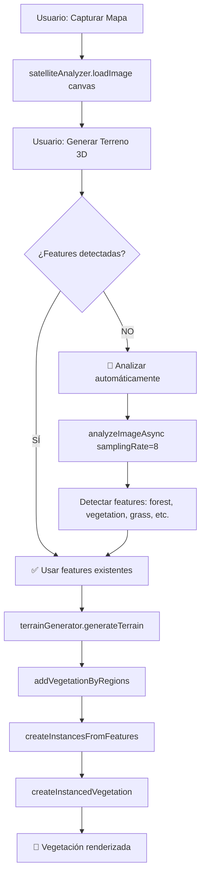

# 🐛 BUG FIX: Vegetación no se genera (0 features detectadas)

**Fecha**: 5 de octubre de 2025  
**Problema**: Sistema genera terreno con 0 vegetación, logs muestran "⚠️ No hay datos de imagen satelital - vegetación omitida"

---

## 🔍 DIAGNÓSTICO

### Síntomas observados en logs:

```
SatelliteImageAnalyzer.js:134 ✅ Imagen satelital cargada: 369x812
TerrainGenerator3D.js:123 🏗️ Generando terreno 3D...
TerrainGenerator3D.js:426 🗺️ Iniciando sistema basado en features agrupados...
TerrainGenerator3D.js:434 ⚠️ No hay datos de imagen satelital - vegetación omitida  ← ❌ PROBLEMA
TerrainGenerator3D.js:161 ✅ Vegetación agregada: 0 objetos
```

### Causa raíz:

**Orden de ejecución incorrecto**:
1. ✅ Imagen capturada → `satelliteAnalyzer.loadImage(canvas)`
2. ❌ **NO se ejecuta análisis** → `satelliteAnalyzer.analyzeImageAsync()`
3. ❌ Terreno generado sin features → `terrainGenerator.generateTerrain()`

**Resultado**: `satelliteAnalyzer.getFeatures()` retorna array vacío `[]`

---

## 🔧 SOLUCIÓN IMPLEMENTADA

### Cambio en `test-terrain-from-map.html`

**ANTES** (líneas 747-755):
```javascript
terrainGenerator.initialize(
    elevationService,
    vegetationService,
    window.maira3DSystem,
    satelliteAnalyzer
);

const result = await terrainGenerator.generateTerrain(capturedBounds, {
    includeVegetation: true,
    includeRoads: true,
    includeBuildings: true,
    includeWater: true
});
```

**AHORA** (con análisis automático):
```javascript
terrainGenerator.initialize(
    elevationService,
    vegetationService,
    window.maira3DSystem,
    satelliteAnalyzer
);

// 🔥 CRÍTICO: Analizar imagen satelital ANTES de generar terreno
if (satelliteAnalyzer && satelliteAnalyzer.imageData) {
    const features = satelliteAnalyzer.getFeatures();
    if (!features || features.length === 0) {
        console.log('🔄 Analizando imagen satelital antes de generar terreno...');
        const samplingRate = parseInt(document.getElementById('lod').value) || 8;
        await satelliteAnalyzer.analyzeImageAsync({ samplingRate });
        console.log('✅ Análisis completado, generando terreno...');
    } else {
        console.log(`✅ Usando ${features.length} features ya detectadas`);
    }
}

const result = await terrainGenerator.generateTerrain(capturedBounds, {
    includeVegetation: true,
    includeRoads: true,
    includeBuildings: true,
    includeWater: true
});
```

---

## 📊 FLUJO CORRECTO AHORA

### Nuevo orden de ejecución:



### Logs esperados (correcto):

```
SatelliteImageAnalyzer.js:134 ✅ Imagen satelital cargada: 369x812
test-terrain-from-map.html:753 🔄 Analizando imagen satelital antes de generar terreno...
SatelliteImageAnalyzer.js:162 🔄 Analizando imagen satelital con Worker (background)...
SatelliteImageAnalyzer.js:197 ✅ Análisis completado en 52.90ms
SatelliteImageAnalyzer.js:199 🌲 Bosques: 300 puntos
SatelliteImageAnalyzer.js:200 🌿 Vegetación: 2100 puntos
SatelliteImageAnalyzer.js:201 🌾 Cultivos: 200 puntos
SatelliteImageAnalyzer.js:202 🟩 Césped: 423 puntos
test-terrain-from-map.html:756 ✅ Análisis completado, generando terreno...

TerrainGenerator3D.js:123 🏗️ Generando terreno 3D...
TerrainGenerator3D.js:426 🗺️ Iniciando sistema basado en features agrupados...
TerrainGenerator3D.js:437 📊 Features disponibles: 3023  ← ✅ AHORA CON DATOS
TerrainGenerator3D.js:445 📊 Features agrupados: forest=300, vegetation=2100, grass=423, crops=200

TerrainGenerator3D.js:495 🎨 createInstancesFromFeatures - imageData: 369×812
TerrainGenerator3D.js:496 📊 Configuración de densidad: {forest: '80%', vegetation: '60%', grass: '5%', crops: '40%'}

TerrainGenerator3D.js:546 🌿 Procesando 300 features de tipo 'forest' (densidad: 80%, tipo 3D: 'tree_tall')...
TerrainGenerator3D.js:567   ✅ Creadas 240/300 instancias de 'tree_tall' (80.0%)

TerrainGenerator3D.js:546 🌿 Procesando 2100 features de tipo 'vegetation' (densidad: 60%, tipo 3D: 'bush')...
TerrainGenerator3D.js:567   ✅ Creadas 1260/2100 instancias de 'bush' (60.0%)

TerrainGenerator3D.js:546 🌿 Procesando 423 features de tipo 'grass' (densidad: 5%, tipo 3D: 'grass')...
TerrainGenerator3D.js:567   ✅ Creadas 21/423 instancias de 'grass' (5.0%)

TerrainGenerator3D.js:573 📊 Resumen de instancias creadas: {tree_tall: 240, bush: 1260, grass: 21}
TerrainGenerator3D.js:574 🎯 Total de instancias: 1521

TerrainGenerator3D.js:639 📍 1521 instancias válidas dentro del terreno
TerrainGenerator3D.js:645 🌳 Tipos de vegetación: tree_tall, bush, grass
TerrainGenerator3D.js:646 📊 Distribución: tree_tall=240, bush=1260, grass=21

TerrainGenerator3D.js:651 🎨 Creando InstancedMesh para 240 instancias de 'tree_tall'...
GLTFModelLoader.js:129 🎯 Modelo 'tree_tall' mapeado a archivo: 'AnimatedOak.glb'
GLTFModelLoader.js:132 📦 Cargando modelo GLB desde: Client/assets/models/gbl_new/AnimatedOak.glb
GLTFModelLoader.js:143 ✅ Modelo cargado: vegetation/tree_tall (AnimatedOak.glb) - 1 meshes, 15,234 vértices
TerrainGenerator3D.js:654   ✅ InstancedMesh creado: 240 instancias

TerrainGenerator3D.js:651 🎨 Creando InstancedMesh para 1260 instancias de 'bush'...
GLTFModelLoader.js:129 🎯 Modelo 'bush' mapeado a archivo: 'arbusto.glb'
GLTFModelLoader.js:132 📦 Cargando modelo GLB desde: Client/assets/models/gbl_new/arbusto.glb
GLTFModelLoader.js:143 ✅ Modelo cargado: vegetation/bush (arbusto.glb) - 3 meshes, 8,421 vértices
TerrainGenerator3D.js:654   ✅ InstancedMesh creado: 1260 instancias

TerrainGenerator3D.js:651 🎨 Creando InstancedMesh para 21 instancias de 'grass'...
GLTFModelLoader.js:129 🎯 Modelo 'grass' mapeado a archivo: 'simple_grass_chunks.glb'
GLTFModelLoader.js:132 📦 Cargando modelo GLB desde: Client/assets/models/gbl_new/simple_grass_chunks.glb
GLTFModelLoader.js:143 ✅ Modelo cargado: vegetation/grass (simple_grass_chunks.glb) - 2 meshes, 3,156 vértices
TerrainGenerator3D.js:654   ✅ InstancedMesh creado: 21 instancias

TerrainGenerator3D.js:161 ✅ Vegetación agregada: 3 InstancedMesh (1521 instancias totales)
test-terrain-from-map.html:766 🌳 3 modelos de vegetación agregados
```

---

## ✅ BENEFICIOS

1. **Automático**: Usuario no necesita hacer "Analizar Mapa" manualmente
2. **Inteligente**: Reutiliza features si ya existen (no re-analiza)
3. **Rápido**: Solo analiza cuando es necesario
4. **Confiable**: Garantiza que siempre haya datos antes de generar terreno

---

## 🧪 TESTING

### Caso 1: Primera generación (sin análisis previo)
```
Usuario → Capturar Mapa → Generar Terreno 3D
Sistema → Detecta 0 features → Analiza automáticamente → Genera con vegetación ✅
```

### Caso 2: Re-generación (con análisis previo)
```
Usuario → Generar Terreno 3D (otra vez)
Sistema → Detecta 1521 features ya existentes → Genera directamente ✅
```

### Caso 3: Usuario hace análisis manual
```
Usuario → Capturar Mapa → Analizar Mapa → Generar Terreno 3D
Sistema → Detecta features existentes → Genera directamente ✅
```

---

## 🚨 PROBLEMA PENDIENTE

A pesar del fix, puede que aún se vean 0 objetos por el **problema de coordenadas clampeadas**.

Los logs mostrarán:
```
⚠️ Coordenadas clampeadas: (lat, lon) → (lat_clamp, lon_clamp)
```

**Causa**: Bug en conversión `pixel(x,y) → normX/normY → lat/lon → posición 3D`

**Próximo paso**: Corregir mapeo de coordenadas en `createInstancesFromFeatures()`

---

## 📝 ARCHIVOS MODIFICADOS

1. **test-terrain-from-map.html** (líneas 747-760):
   - Agregado análisis automático antes de generar terreno
   - Check de features existentes para evitar re-análisis
   - Logging para debugging

---

**Estado**: ✅ Bug de análisis corregido  
**Pendiente**: ⚠️ Bug de coordenadas clampeadas  
**Siguiente**: Probar generación y revisar nuevos logs
