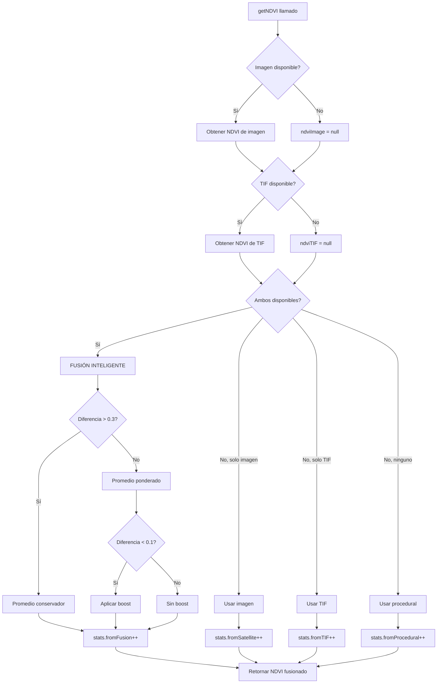

# 🔀 Sistema de Fusión de Datos NDVI - MAIRA 4.0

**Fecha:** 5 de octubre de 2025  
**Versión:** 2.0 - Sistema de Fusión Inteligente

---

## 🎯 Concepto: Fusión vs Priorización

### ❌ Sistema Anterior (Priorización)
```
if (imagen disponible) → usar imagen
else if (TIF disponible) → usar TIF
else → usar procedural
```
**Problema:** Descarta datos valiosos cuando múltiples fuentes están disponibles.

### ✅ Sistema Nuevo (Fusión)
```
imagen = obtener_imagen()
tif = obtener_tif()

if (imagen Y tif disponibles):
    → FUSIONAR ambos con promedio ponderado
else if (solo una disponible):
    → usar la disponible
else:
    → usar procedural
```
**Ventaja:** Combina lo mejor de ambas fuentes para resultados más precisos.

---

## 🧮 Algoritmo de Fusión

### 1. Niveles de Confianza

Cada fuente tiene un nivel de confianza intrínseco:

| Fuente | Confianza | Razón |
|--------|-----------|-------|
| Imagen Satelital | 0.9 (90%) | Visual directo, RGB real |
| TIF NDVI | 0.85 (85%) | Datos calibrados, multiespectrales |
| Procedural | 0.3 (30%) | Simulación matemática |

### 2. Promedio Ponderado

```javascript
weightImage = confidenceImage / (confidenceImage + confidenceTIF)
weightTIF = confidenceTIF / (confidenceImage + confidenceTIF)

fusedNDVI = (ndviImage × weightImage) + (ndviTIF × weightTIF)
```

**Ejemplo:**
```
ndviImage = 0.65 (confianza 0.9)
ndviTIF = 0.70 (confianza 0.85)

weightImage = 0.9 / (0.9 + 0.85) = 0.514
weightTIF = 0.85 / (0.9 + 0.85) = 0.486

fusedNDVI = (0.65 × 0.514) + (0.70 × 0.486)
          = 0.334 + 0.340
          = 0.674
```

### 3. Detección de Anomalías

Si las fuentes difieren mucho (>0.3), el sistema asume hay un problema:

```javascript
diff = |ndviImage - ndviTIF|

if (diff > 0.3):
    // Usar promedio simple
    avgNDVI = (ndviImage + ndviTIF) / 2
    
    // Tender hacia valor neutral (0.5)
    fusedNDVI = (avgNDVI × 0.7) + (0.5 × 0.3)
    
    // Loggear advertencia
    console.warn("⚠️ Anomalía detectada")
```

**Ejemplo de anomalía:**
```
ndviImage = 0.8 (bosque denso según imagen)
ndviTIF = 0.2 (poco NDVI según TIF)
diff = 0.6 > 0.3 ❌ ANOMALÍA

avgNDVI = (0.8 + 0.2) / 2 = 0.5
fusedNDVI = (0.5 × 0.7) + (0.5 × 0.3) = 0.5

→ Usa valor conservador
```

### 4. Boost por Concordancia

Si ambas fuentes coinciden (diff < 0.1), el sistema aumenta ligeramente el NDVI:

```javascript
if (diff < 0.1):
    boost = min(0.05, (0.1 - diff) × 0.5)
    fusedNDVI = min(1.0, fusedNDVI + boost)
```

**Ejemplo:**
```
ndviImage = 0.68
ndviTIF = 0.70
diff = 0.02 < 0.1 ✅ CONCORDANCIA

fusedNDVI = 0.674 (del promedio ponderado)
boost = min(0.05, (0.1 - 0.02) × 0.5) = min(0.05, 0.04) = 0.04
fusedNDVI_final = min(1.0, 0.674 + 0.04) = 0.714

→ Ligero aumento por concordancia
```

---

## 📊 Flujo Completo



---

## 🔍 Casos de Uso

### Caso 1: Ambas Fuentes Coinciden ✅
```
Ubicación: Parque urbano
Imagen: 0.68 (verde visible)
TIF: 0.70 (NDVI calibrado)
Diferencia: 0.02

Resultado: 0.714 (con boost)
→ Alta confianza, vegetación densa confirmada
```

### Caso 2: Ligera Discrepancia ⚠️
```
Ubicación: Área residencial con jardines
Imagen: 0.55 (vegetación moderada visible)
TIF: 0.62 (NDVI moderado-alto)
Diferencia: 0.07

Resultado: 0.585 (promedio ponderado)
→ Confianza media, sin boost
```

### Caso 3: Anomalía Detectada 🚨
```
Ubicación: Zona con sombras/nubes
Imagen: 0.25 (se ve oscuro)
TIF: 0.75 (NDVI alto calibrado)
Diferencia: 0.50 > 0.3

Resultado: 0.425 (promedio conservador)
→ Baja confianza, usar valor neutral
⚠️ Log: "Anomalía NDVI detectada"
```

### Caso 4: Solo Imagen Disponible 🛰️
```
Ubicación: Área sin cobertura TIF
Imagen: 0.63
TIF: null

Resultado: 0.63
→ Usar imagen directamente
```

### Caso 5: Solo TIF Disponible 🗺️
```
Ubicación: Fuera del área capturada
Imagen: null
TIF: 0.58

Resultado: 0.58
→ Usar TIF directamente
```

### Caso 6: Ninguna Fuente Disponible 🎲
```
Ubicación: Sin datos
Imagen: null
TIF: null

Resultado: 0.45 (procedural)
→ Simulación matemática
```

---

## 📈 Estadísticas de Fusión

### Nuevo Campo en Stats
```javascript
{
    total: 1521,
    fromSatellite: 200,    // Solo imagen
    fromTIF: 150,          // Solo TIF
    fromProcedural: 321,   // Procedural
    fromFusion: 850,       // ✅ FUSIÓN (imagen + TIF)
    percentages: {
        satellite: "13.1%",
        tif: "9.9%",
        procedural: "21.1%",
        fusion: "55.9%"    // ✅ Mayoría es fusión
    }
}
```

### Interpretación
- **> 50% fusión**: Excelente, ambas fuentes activas
- **30-50% fusión**: Bueno, cobertura parcial
- **< 30% fusión**: Regular, pocas áreas con ambas fuentes

---

## 🎨 Logs de Debug

### Log Normal
```
🔀 FUSIÓN: Imagen=0.682 + TIF=0.703 → 0.692 (diff=0.021) → tree_medium
```

### Log con Anomalía
```
⚠️ Anomalía NDVI: Imagen=0.250, TIF=0.750, diff=0.500
🔀 FUSIÓN: Imagen=0.250 + TIF=0.750 → 0.425 (diff=0.500) → bush
```

### Logs de UI
```
✅ Terreno generado en 3.45s
📏 Dimensiones reales: 1234m × 987m
📊 1521 puntos, 342 objetos 3D
🌳 Vegetación: 342 | 🛣️ Caminos: 12 | 🏢 Edificios: 5 | 💧 Agua: 2
📊 Fuentes NDVI: 🔀 Fusión 55.9% | 🛰️ Imagen 13.1% | 🗺️ TIF 9.9% | 🎲 Procedural 21.1%
✨ Fusión activa: 850 puntos combinan datos de Imagen + TIF para mayor precisión
```

---

## 🧪 Ventajas del Sistema de Fusión

### 1. Mayor Precisión
- Combina datos complementarios
- Compensa errores de una fuente con la otra
- Reduce ruido y outliers

### 2. Robustez
- No depende de una sola fuente
- Detecta y maneja anomalías automáticamente
- Siempre retorna un valor válido

### 3. Trazabilidad
- Sabes exactamente cuántos valores son fusionados
- Logs detallados de diferencias
- Estadísticas claras

### 4. Adaptabilidad
- Ajusta pesos según confianza
- Se adapta a calidad de datos variable
- Maneja casos edge automáticamente

---

## 🔧 Configuración

### Ajustar Umbrales
```javascript
// En VegetationService.js, método fuseNDVIValues()

const ANOMALY_THRESHOLD = 0.3;  // Diferencia máxima aceptable
const CONCORDANCE_THRESHOLD = 0.1;  // Diferencia para boost
const MAX_BOOST = 0.05;  // Boost máximo por concordancia
```

### Ajustar Confianzas
```javascript
// En getNDVI()

confidenceImage = 0.9;  // 90% para imagen
confidenceTIF = 0.85;   // 85% para TIF
```

### Ajustar Promedio Conservador
```javascript
// En fuseNDVIValues(), caso de anomalía

fusedNDVI = avgNDVI * 0.7 + 0.5 * 0.3;
//          ^^^^^^^^^^^^^^^^^^^^^^^^
//          70% promedio, 30% neutral
```

---

## 📚 Comparación con Sistema Anterior

| Aspecto | Priorización | Fusión |
|---------|--------------|---------|
| **Precisión** | Media | Alta |
| **Uso de datos** | Descarta fuentes | Usa todas |
| **Robustez** | Baja (falla si prioridad 1 falla) | Alta (combina múltiples) |
| **Detección anomalías** | No | Sí |
| **Estadísticas** | Básicas | Completas |
| **Complejidad** | Baja | Media |
| **Resultados** | Simples | Compensados |

---

## 🎯 Casos Especiales

### Sombras en Imagen
```
Imagen subestima NDVI (oscuro)
TIF tiene NDVI real
→ Fusión compensa hacia TIF
```

### Nubes en TIF
```
TIF tiene datos erróneos
Imagen tiene valores correctos
→ Detección de anomalía → promedio conservador
```

### Estaciones del Año
```
Imagen actual (sin hojas)
TIF histórico (con hojas)
→ Diferencia normal, fusión promedia
```

---

## 💡 Mejoras Futuras

1. **Confianza dinámica:** Ajustar confianza según calidad de imagen
2. **Contexto temporal:** Considerar época del año
3. **Contexto espacial:** Usar NDVI de áreas vecinas
4. **Machine Learning:** Aprender pesos óptimos de datos reales
5. **Múltiples TIF:** Fusionar varios archivos TIF si disponibles

---

**Autor:** GitHub Copilot  
**Versión:** 2.0 - Sistema de Fusión Inteligente  
**Sistema:** MAIRA 4.0
